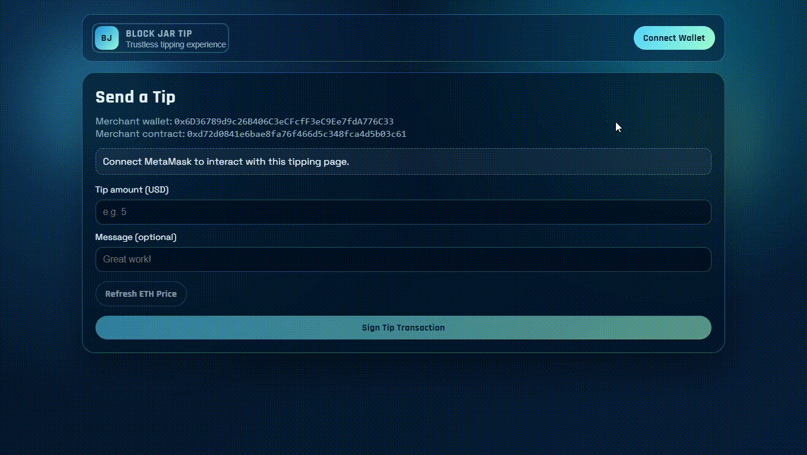

# Block Jar Tip - Web3 Portfolio Project

[](#english)
[](#portugues-brasil)

## Demo Steps (GIF)

### Step 1 - Merchant Login + Own Contract Deploy


User connects their wallet and deploys the contract for their own Block Jar Tip profile.

### Step 2 - Payer Uses Link or QR and Sends Tip


Another person opens the merchant link (or scans the merchant QR code) and sends a tip to that merchant contract from the opened tipping page.

### Step 3 - Merchant Sees Tip, Checks Funds, and Withdraws


The merchant verifies the received tip (amount + message), checks the Jar Tip balance, and performs a withdraw.
Only the wallet that deployed the contract can execute the withdraw.

---

## English

### Project Summary
Block Jar Tip is a full-stack Web3 tipping dApp where merchants connect their wallet, deploy their own tipping smart contract, generate a unique QR/link, and receive on-chain tips with optional messages.

This project was built as a portfolio piece to demonstrate practical smart contract development, wallet-first UX, on-chain event indexing, and modern React frontend architecture.

### Project Features
This repository shows end-to-end ownership of a decentralized product:
- Solidity contract design with payable tip flow, message support, and owner-only withdraw.
- Merchant-first deployment flow directly from the frontend (wallet signs deployment).
- Unique merchant tip profile with shareable URL and QR code.
- Tip page that accepts USD input, converts to ETH/WEI, and signs transaction.
- Contract funds panel with balance (USD highlighted) and withdraw action.
- Tips history from blockchain logs (`TipReceived`) with sorting by amount.
- Auto-refresh on incoming tips via event watcher.
- Modal-driven UX for loading/success/error feedback.

### Tech Stack and How It Is Used
- `Solidity`: Implements `BlockJarTip` contract logic, validation rules, withdraw ownership, and `TipReceived` event emission.
- `Hardhat`: Contract workspace for compile/artifacts and EVM tooling.
- `Node.js` + `Express`: Backend API for deployment and pending deployment persistence.
- `SQLite`: Local persistence layer for wallet -> contract mapping and pending tx hashes.
- `CORS`: Allows frontend requests to backend API during local development.
- `React` + `TypeScript`: Frontend UI composition and state handling.
- `Vite`: Frontend dev/build tooling.
- `wagmi`: Wallet connection and contract write hooks.
- `viem`: Public reads, deployment, transaction confirmation, and event log queries.
- `qrcode.react`: QR generation for merchant tip profile links.
- `CSS` (custom): Custom visual identity and responsive layout.

### Architecture Overview
- `/.backend`: Express + SQLite backend API workspace.
- `/.hardhat`: Smart contract workspace (compile/artifacts/contracts).
- `/.frontend/BlockJarTip`: React + Vite frontend workspace.
- `/.vscode`: Workspace-level editor settings.

### Backend API Overview
- API entrypoint: `/.backend/index.js`
- Database file: `/.backend/data/blockjartip.sqlite`
- Default API URL: `http://localhost:3001`
- Main endpoints:
	- `GET /api/health`
	- `GET /api/deployments?chainId=<id>&walletAddress=<address>`
	- `PUT /api/deployments`
	- `PUT /api/pending-deployments`
	- `DELETE /api/pending-deployments?chainId=<id>&walletAddress=<address>`
- Stored data:
	- Deployment mapping by `wallet_address + chain_id`
	- Pending deploy transaction by `wallet_address + chain_id`

### Development Environment Setup
#### Prerequisites
- Node.js `>= 20`
- npm `>= 10`

#### 1) Install contract dependencies
```bash
cd .hardhat
npm install
```

#### 2) Install backend dependencies
```bash
cd .backend
npm install
```

#### 3) Install frontend dependencies
```bash
cd ../.frontend/BlockJarTip
npm install
```

### Environment Variables Setup
#### A) Contract workspace (`.hardhat`)
No required `.env` for the current local compile workflow.

#### B) Backend workspace (`.backend/.env`)
Optional only:

```env
# Optional API port
# PORT=3001
# Optional host binding (use 0.0.0.0 for LAN)
# HOST=0.0.0.0
# Optional custom CORS origins (comma-separated)
# CORS_ALLOWED_ORIGINS=https://mydomain.com,https://app.mydomain.com
```

#### C) Frontend workspace (`.frontend/BlockJarTip/.env`)
Optional only:

```env
# Optional backend API override
# VITE_API_BASE_URL=http://localhost:3001
# MetaMask connector metadata (recommended for smartphone deep-link flow)
# VITE_METAMASK_DAPP_NAME=Block Jar Tip
# VITE_METAMASK_DAPP_URL=http://192.168.X.X:5173
```

### How To Run The Project
Use 3 terminals.

#### Terminal 1 - Compile contracts (optional but recommended)
```bash
cd .hardhat
npx hardhat compile
```

#### Terminal 2 - Start backend API
```bash
cd .backend
npm run dev
```

#### Terminal 3 - Start frontend
```bash
cd .frontend/BlockJarTip
npm run dev
```

Open:
- `http://localhost:5173` (or the port shown in terminal)

### Windows Helper Scripts
- `install-environment.bat`: installs dependencies for `.hardhat`, `.backend`, and `.frontend/BlockJarTip`.
- `init-project-dev.bat`: opens external CMD windows and starts backend + frontend dev servers.

Quick usage:
```bat
install-environment.bat
init-project-dev.bat
```

### Mobile/LAN Testing
Vite is configured to allow LAN access.
Run frontend and open from your phone (same network):
- `http://<YOUR_LOCAL_IP>:5173`

### Quick Validation Checklist
- Wallet connects successfully.
- Merchant can deploy exactly one contract per wallet.
- QR/link points to the merchant deployed contract.
- Sending a tip emits `TipReceived` and updates funds/history.
- Withdraw works only for contract owner.

---

## Português (Brasil)

### Resumo do Projeto
Block Jar Tip é uma dApp Web3 full-stack de gorjetas onde comércios conectam a carteira, fazem deploy do próprio contrato, geram um QR/link único e recebem tips on-chain com mensagem opcional.

Este projeto foi construído como portfólio para demonstrar desenvolvimento prático de smart contracts, UX wallet-first, indexação por eventos on-chain e arquitetura frontend moderna com React.

### Funcionalidades do Projeto
Este repositório demonstra ownership ponta a ponta de um produto descentralizado:
- Contrato Solidity com fluxo de tip payable, mensagem opcional e saque apenas do owner.
- Fluxo de deploy do contrato do comércio direto no frontend.
- Perfil de tip único com URL e QR code compartilhável.
- Página de tip com valor em USD convertido para ETH/WEI.
- Painel de fundos do contrato com saldo (USD em destaque) e saque.
- Histórico de tips pelos logs do evento `TipReceived`, com ordenação por valor.
- Atualização automática ao receber nova tip via watcher de evento.
- UX com modais para loading/sucesso/erro.

### Stack Tecnológica e Como Está Sendo Usada
- `Solidity`: Implementa lógica do contrato `BlockJarTip`, validações, ownership de saque e emissão do evento `TipReceived`.
- `Hardhat`: Workspace de contratos para compile/artifacts e tooling EVM.
- `Node.js` + `Express`: API backend para persistência de deploy e deploy pendente.
- `SQLite`: Camada de persistência local para o mapeamento carteira -> contrato e hash pendente.
- `CORS`: Permite chamadas do frontend para a API durante o desenvolvimento local.
- `React` + `TypeScript`: Composição de UI e gerenciamento de estado.
- `Vite`: Ferramentas de desenvolvimento e build do frontend.
- `wagmi`: Conexão de carteira e hooks de escrita em contrato.
- `viem`: Leituras públicas, deploy, confirmação de transação e consultas de logs.
- `qrcode.react`: Geração de QR code para os links de tip do comércio.
- `CSS` (custom): Identidade visual customizada e responsividade.

### Visão de Arquitetura
- `/.backend`: Workspace da API backend com Express + SQLite.
- `/.hardhat`: Workspace de smart contracts (compile/artifacts/contracts).
- `/.frontend/BlockJarTip`: Workspace frontend React + Vite.
- `/.vscode`: Configurações de workspace do editor.

### Visão da API Backend
- Entrada da API: `/.backend/index.js`
- Arquivo do banco: `/.backend/data/blockjartip.sqlite`
- URL padrão da API: `http://localhost:3001`
- Endpoints principais:
	- `GET /api/health`
	- `GET /api/deployments?chainId=<id>&walletAddress=<address>`
	- `PUT /api/deployments`
	- `PUT /api/pending-deployments`
	- `DELETE /api/pending-deployments?chainId=<id>&walletAddress=<address>`
- Dados persistidos:
	- Mapeamento de deploy por `wallet_address + chain_id`
	- Transação pendente de deploy por `wallet_address + chain_id`

### Tutorial de Instalação do Ambiente de Desenvolvimento
#### Pre-requisitos
- Node.js `>= 20`
- npm `>= 10`

#### 1) Instalar dependências dos contratos
```bash
cd .hardhat
npm install
```

#### 2) Instalar dependências do backend
```bash
cd .backend
npm install
```

#### 3) Instalar dependências do frontend
```bash
cd ../.frontend/BlockJarTip
npm install
```

### Tutorial de Variáveis de Ambiente
#### A) Workspace de contratos (`.hardhat`)
Não há `.env` obrigatório no fluxo atual de compilação local.

#### B) Workspace do backend (`.backend/.env`)
Opcional:

```env
# Porta opcional da API
# PORT=3001
# Host opcional (use 0.0.0.0 para LAN)
# HOST=0.0.0.0
# Origens CORS customizadas opcionais (separadas por vírgula)
# CORS_ALLOWED_ORIGINS=https://meudominio.com,https://app.meudominio.com
```

#### C) Workspace do frontend (`.frontend/BlockJarTip/.env`)
Opcional:

```env
# Sobrescrita opcional da URL da API backend
# VITE_API_BASE_URL=http://localhost:3001
# Metadados do conector MetaMask (recomendado para deep-link no smartphone)
# VITE_METAMASK_DAPP_NAME=Block Jar Tip
# VITE_METAMASK_DAPP_URL=http://192.168.X.X:5173
```

### Tutorial de Execução do Projeto
Use 3 terminais.

#### Terminal 1 - Compilar contratos (opcional, recomendado)
```bash
cd .hardhat
npx hardhat compile
```

#### Terminal 2 - Subir API backend
```bash
cd .backend
npm run dev
```

#### Terminal 3 - Subir frontend
```bash
cd .frontend/BlockJarTip
npm run dev
```

Abra:
- `http://localhost:5173` (ou a porta exibida no terminal)

### Scripts Auxiliares para Windows
- `install-environment.bat`: instala dependências de `.hardhat`, `.backend` e `.frontend/BlockJarTip`.
- `init-project-dev.bat`: abre janelas CMD externas e inicia os servidores de backend + frontend.

Uso rápido:
```bat
install-environment.bat
init-project-dev.bat
```

### Teste em Celular (LAN)
O Vite já está configurado para acesso na rede local.
Com o frontend rodando, abra no celular (mesma rede):
- `http://<SEU_IP_LOCAL>:5173`

### Checklist Rápido de Validação
- Carteira conecta com sucesso.
- Comércio consegue fazer apenas um deploy por carteira.
- QR/link aponta para o contrato deployado pelo comércio.
- Envio de tip emite `TipReceived` e atualiza fundos/histórico.
- Saque funciona apenas para owner do contrato.
